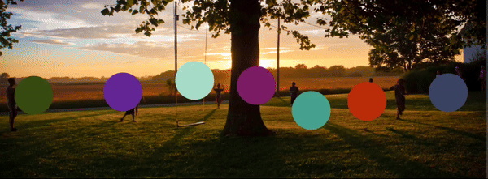

# Hi, I'm Amanuel Tito

**Mobile Developer & Full-Stack Engineer** · Addis Ababa, Ethiopia

I build Flutter applications and architect backend systems with NestJS, Firebase, Supabase, and Redis. My work spans digital wallets, financing, commerce, ERP integrations, and Telegram platforms, with a focus on modular APIs, reliable background jobs, and maintainable architecture.

[LinkedIn](https://linkedin.com/in/emantggw) · [Telegram](https://t.me/emantggw) · [Email](mailto:emantweb@gmail.com) · [Medium](https://medium.com/@emantggw) · [Dev.to](https://dev.to/emantggw) · [X](https://x.com/emantggw) · [LeetCode](https://leetcode.com/u/emantggw/)

## Technical Skills

- **Backend:** NestJS, Node.js, TypeScript, Python, REST APIs, Telegram Bot API, Telegraf
- **Data & infrastructure:** Firebase / Firestore, Supabase, PostgreSQL, Redis, Bull / BullMQ, Docker, Nginx, CI/CD
- **Mobile:** Flutter, Dart, Android, Riverpod, BLoC, Stacked, MVVM, Clean Architecture
- **Web:** Flutter Web, Next.js (Intermediate)
- **Engineering:** API design, data modeling, caching, automated testing, code review, team mentorship

## Featured Projects

### Asayew

**Telegram advertising marketplace** connecting channel owners and advertisers. A modular NestJS backend supports wallet-based ad purchases, Firestore transactions, Redis caching, and Bull jobs for automated publishing, pin scheduling, and expiry. The Next.js frontend provides role-based dashboards with English and Amharic interfaces.

- **Backend:** NestJS, TypeScript, Firebase / Firestore, Redis, Bull, Telegraf
- **Frontend:** Next.js, React, Tailwind CSS, shadcn/ui, next-intl
- **Explore:** [Website](https://asayew.com) · [Telegram bot](https://t.me/asayew_bot)

### Josad

**AI-powered job aggregation platform** serving 15k+ Telegram members. Aggregates jobs from channels and job boards, classifies them with SVM/BERT, and distributes posts through four bots. Includes a Flutter Web employer portal delivered as a Telegram Mini App.

- **Stack:** NestJS, Python, Telegraf, Flutter Web, Firebase, Redis, BullMQ, Docker
- **Explore:** [Website](https://josad.net) · [Telegram community](https://t.me/josad_software)

### Kacha

**Digital wallet and payment application** serving thousands of users. My work includes mobile integrations for partner-bank wallets, onboarding, KYC, payments, and shared white-label Flutter applications.

- **Stack:** Flutter, Firebase, financial-provider APIs
- **Explore:** [Google Play](https://play.google.com/store/apps/details?id=com.kachadfs.customer)

### Berhan Financing

**Mobile financing application** supporting cash loans, salary advances, and school loans.

### HuluBeje

**Commerce super app with 10k+ downloads**, combining cinema ticket booking, hotel reservations, restaurant ordering, payments, and chat. Supporting NestJS services handle order dispatch and real-time seat management.

- **Stack:** Flutter, .NET Core, NestJS, Firebase, Redis, Docker, Nginx
- **Explore:** [Google Play](https://play.google.com/store/apps/details?id=com.cnetsoftwares.cnetpay_client&hl=en)

### CNDroid Mobile POS

**ERP-integrated Android point-of-sale application** for merchant sales, cash receipts, and restaurant order printing.

- **Stack:** Flutter, Android (Java), ERP integration

### More Applications

- **[HuluBeje Delivery Driver](https://play.google.com/store/apps/details?id=com.redcloud.hulubeje_delivery_driver):** Order management and real-time delivery updates, built with Flutter, NestJS, and Supabase.
- **IFB Financing:** Interest-free financing application with multi-bank finance requests, an integrated wallet, and KYC flows.
- **Cinema Display:** Flutter TV application displaying seat layouts, posters, trailers, and upcoming releases in portrait or landscape.
- **Kitchen Display:** Flutter TV application for receiving kitchen orders and tracking their completion.
- **[Flintstone Invest](https://play.google.com/store/apps/details?id=com.flintstone.invest&hl=en):** Investment management application with 10k+ downloads.
- **Nexy Parent:** Mobile application helping parents follow students' progress.

## Professional Experience

### Kacha Digital Service S.C

**Senior Mobile App Developer** · Jan 2026 - Present

- Develop financing and partner-bank wallet applications with provider-specific onboarding, KYC, and payment flows.
- Deliver white-label, co-branded, and insurance applications using a shared Flutter core.
- Maintain Kacha's digital wallet and payment application.

### Red-Cloud ICT Solutions

**Mobile App Development Section Head** · Mar 2022 - Dec 2025

- Led the mobile division, setting architecture standards, reviewing code, and mentoring developers.
- Delivered HuluBeje, its companion delivery-driver application, and CNDroid Mobile POS.
- Built NestJS services for delivery dispatch and real-time seat management, alongside Kitchen Display and Cinema TV applications.

## Open-Source Flutter Packages

- **[WoHttp](https://pub.dev/packages/wo_http):** HTTP client utilities for Flutter applications.
- **[Animated Milestone](https://pub.dev/packages/animated_milestone):** Customizable milestone and timeline components.
- **[Animated React Button](https://pub.dev/packages/animated_react_button):** Animated reaction buttons.
- **[Confirmation Success](https://pub.dev/packages/confirmation_success):** Animated visuals for successful actions.

## Project Gallery

Mobile applications

### HuluBeje

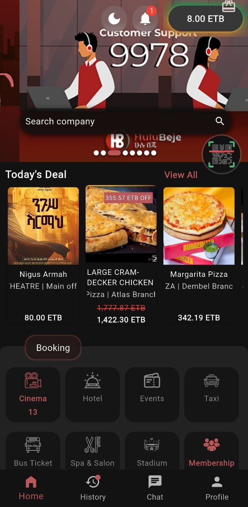
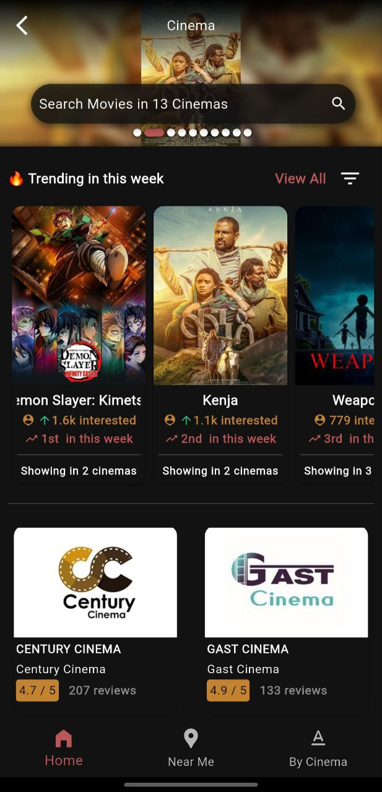
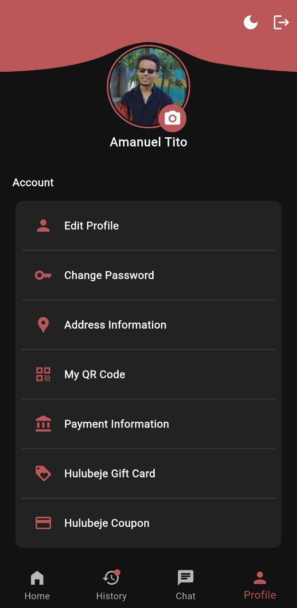

### CNDroid Mobile POS

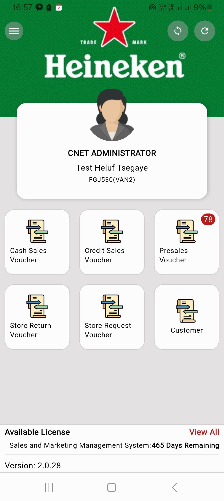
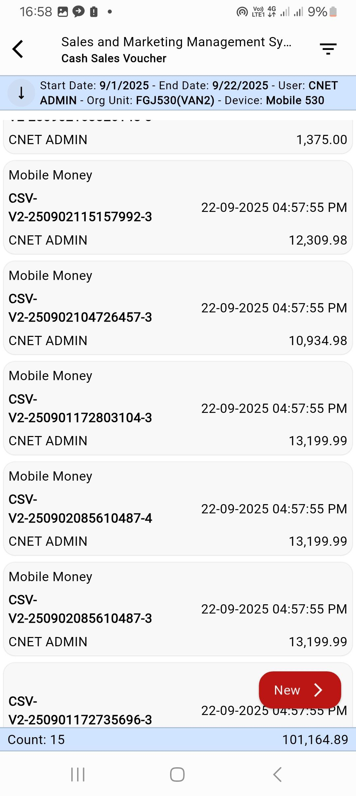

### HuluBeje Delivery Driver

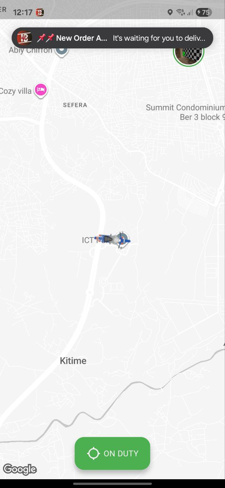
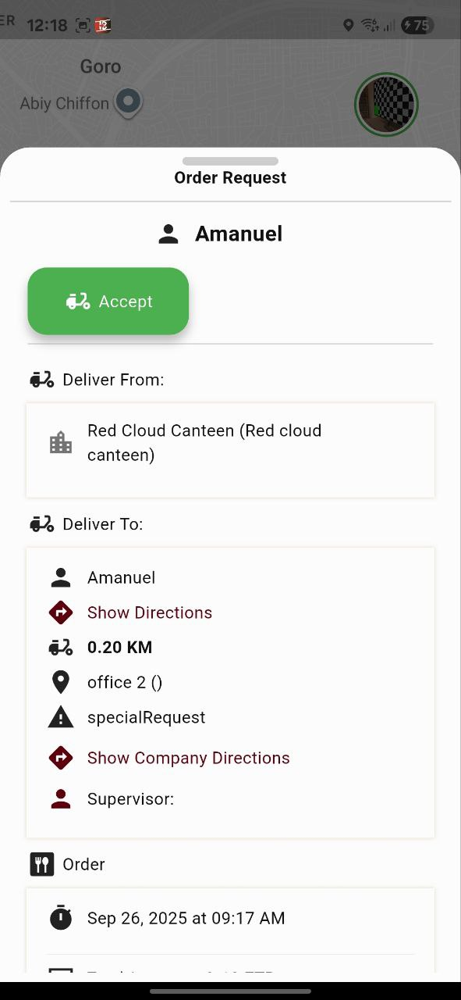
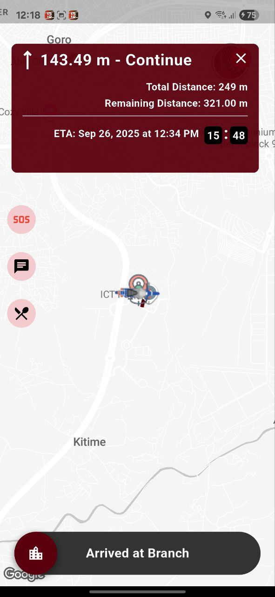

TV applications

### Cinema Display

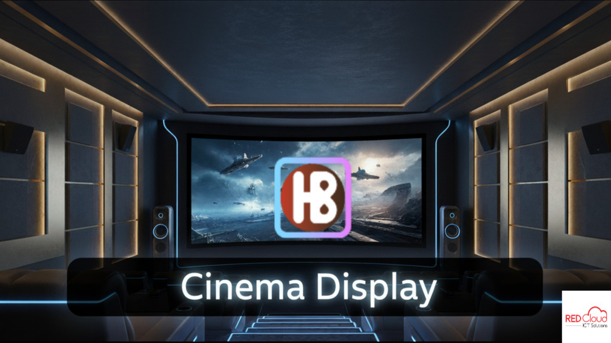
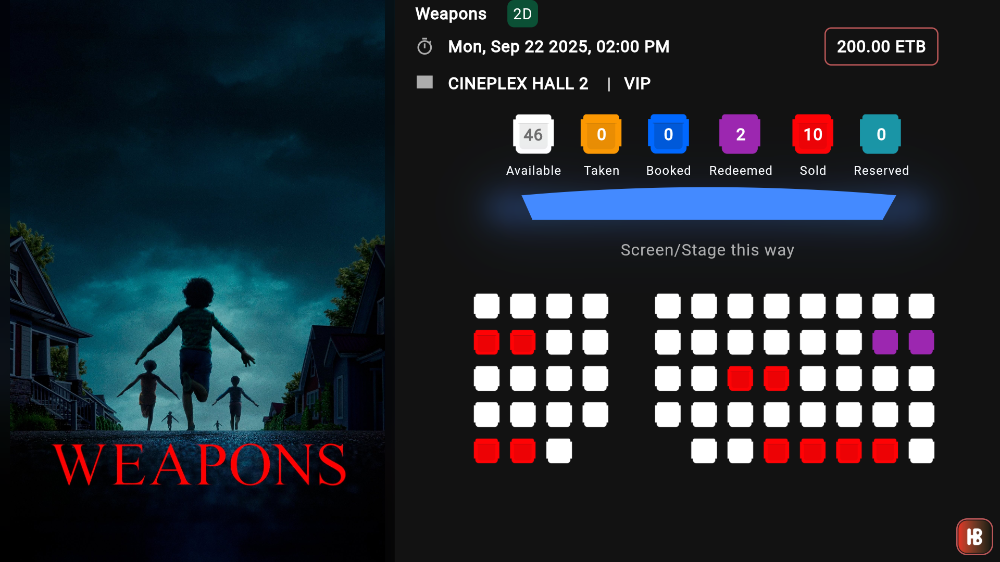
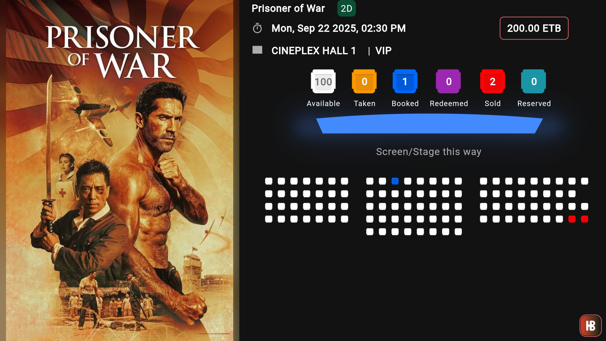

### Kitchen Display

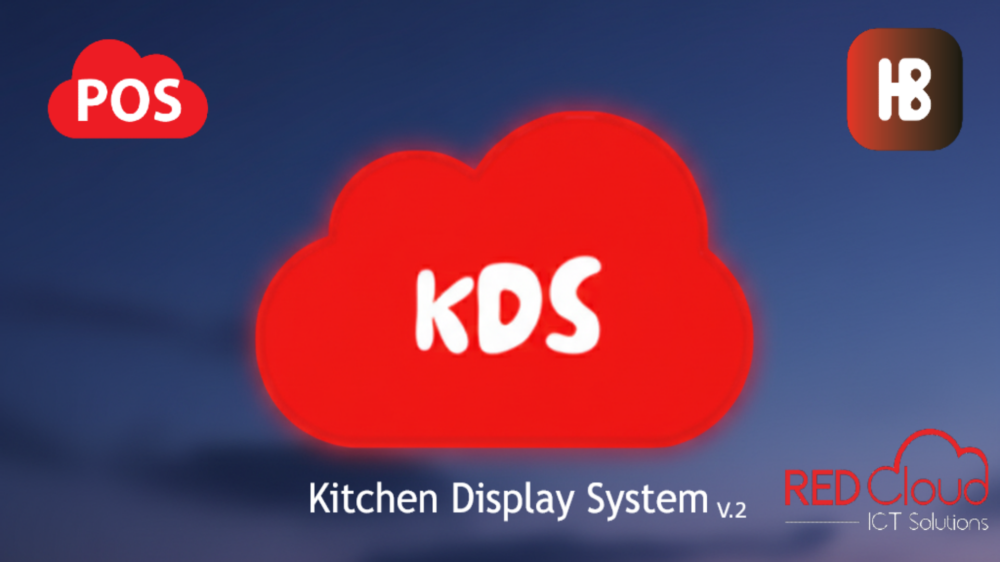
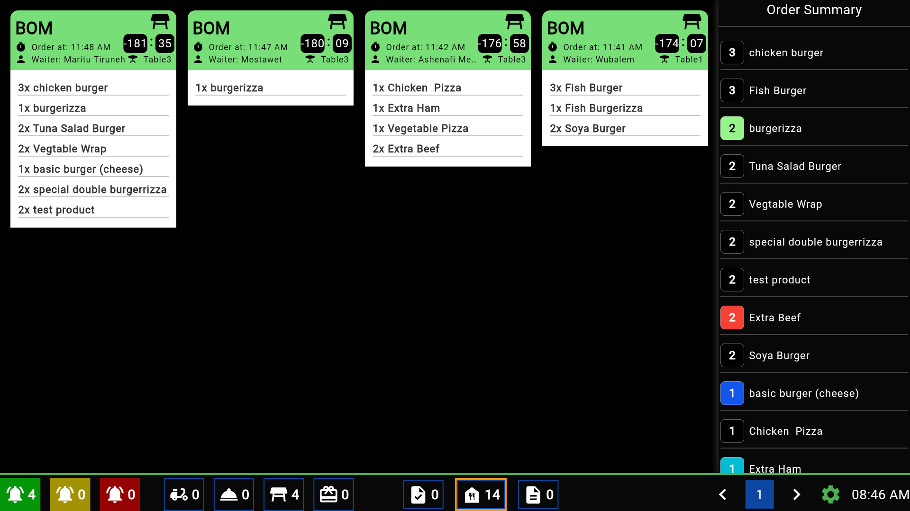
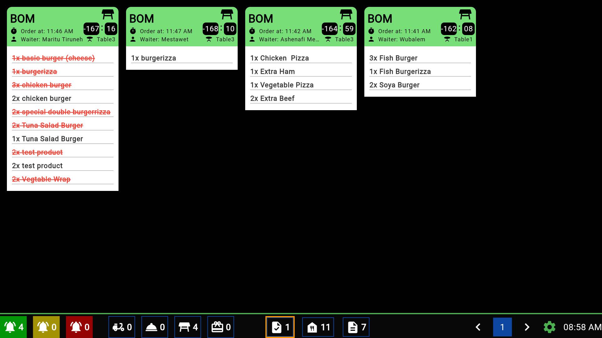

Flutter package demos

### Animated Milestone

### Animated React Button

### Confirmation Success

## Early JavaScript Projects

A selection of games and visual experiments from 2019.

Explore games, clocks, and animations

### [Pool Game](https://github.com/emantggw/pool_game_js)

### [Pong Game with Computer](https://github.com/emantggw/pong_game_js)

### [Snake Game](https://github.com/emantggw/snake_game_js)

### [Analog Clock](https://github.com/emantggw/analog_clock_js)

### [Digital Clock](https://github.com/emantggw/digital_clock_js)

### [Animated Gear Simulation](https://github.com/emantggw/animated_gear_js)

### [Ethiopian Flag Wave](https://github.com/emantggw/ethiopian_flag_wave_js)

### [Windows Booting Animation](https://github.com/emantggw/windows_booting_js)

## Writing

- [DRY Principle](https://medium.com/@emantggw/dry-principle-1d78900fb00e)
- [What Should We Consider When Migrating from a Monolithic Application to a Distributed Architecture?](https://medium.com/@emantggw/what-should-we-consider-migrating-from-a-monolithic-application-to-a-distributed-architecture-2b0f2f8e06b2)

## Education & Recognition

- **BSc in Computer Science**, Arba Minch University, 2021. **CGPA: 3.86 / 4.00**.
- **Huawei ICT Competition Award**, national recognition, 2021.

View Huawei award certificate

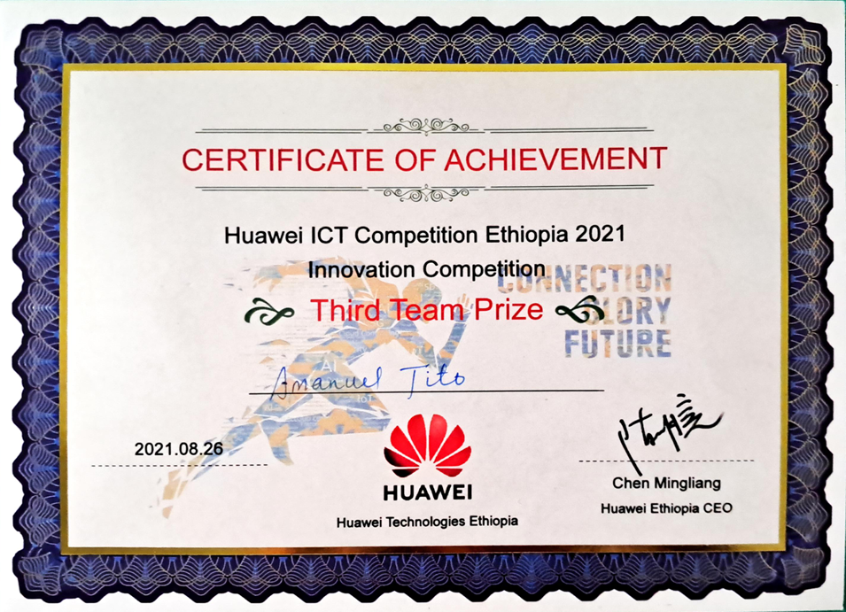

## Get in Touch

Based in Kazanchis, Addis Ababa, Ethiopia. Connect with me on [LinkedIn](https://linkedin.com/in/emantggw), send an [email](mailto:emantweb@gmail.com), or call [+251 939 977 886](tel:+251939977886).
